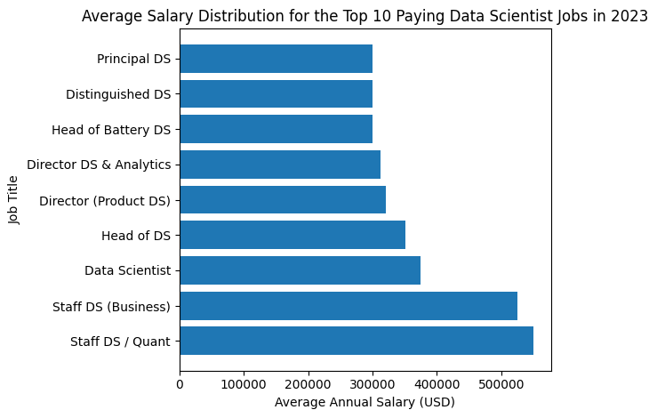
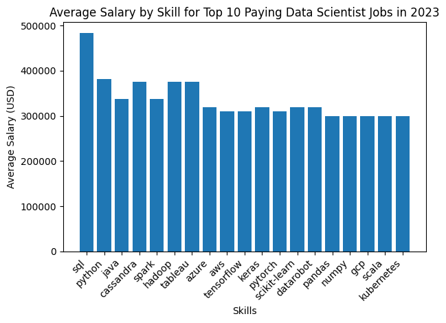
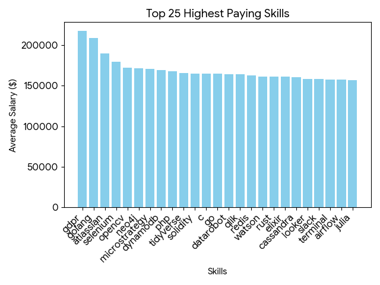
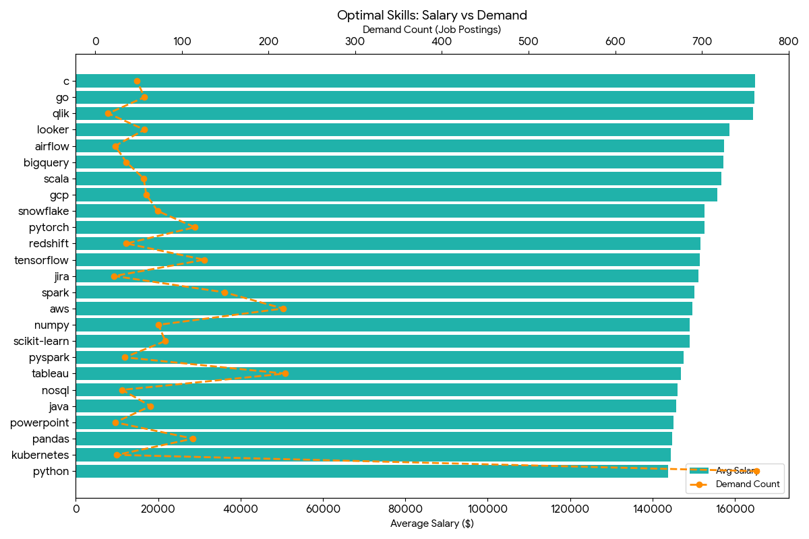

# Introduction

Diving into the data job market! Focusing on data scientist roles, this project explores top-paying jobs, in demand skills and where high deamnd meets high salary in data analytics.

Checkout specific SQL queries here: [project_sql folder](/project_sql/)

# Background

Driven by a quest to navigate the "Data Scientist" job market more effectively, this project was born from a desire to pinpoint top-paid and in-demand skills, while also streamlining others work to find optimal jobs, and or focus on learning key skills.

The data being worked on this project are from [Luke Barousse's YouTube Channel](https://youtu.be/7mz73uXD9DA?si=B-UoPVksz0ZJpp3K). But used for slightly differnent purposes with some much needed changes to tailor it towards Data Science Enthusiast.

### The questions I wanted to answer though these SQL queries were:

1. What are the top-paying Data Scientist jobs?
2. What skills are required for these top-paying jobs?
3. What skills are the most in demand for Data Scientists?
4. Which skills are associated with higher salaries?
5. What are the most optimal skills to learn?

# Tools Used

- **SQL:** The backbone of this analysis, allowing me to query the database and unearth critical insights.
- **PostgreSQL:** The database management system, ideal for handing the data from the job postings.
- **Visual Studio Code:** My go-to for database management and executing SQL queries.
- **Git & Github:** Essential for version control and sharing my SQL scripts and analysis, ensuring collaboration and project tracing.

# The Analysis

Each query for this project aimed at investigating specific aspects of tehe data scientist job market.
Here's how every question was aproached:

### 1. Top Paying Data Scientist Jobs:

To identify the highest-paying roles, I filtered data scientist positions by average yearly salary and location, focusing on remote jobs. This query highliths are high paying opportunities in the field.

```sql
SELECT
    job_id,
    job_title,
    job_location,
    job_schedule_type,
    salary_year_avg,
    job_posted_date,
    name AS company_name
FROM
    job_postings_fact
    LEFT JOIN company_dim ON job_postings_fact.company_id=company_dim.company_id
WHERE
    job_title_short='Data Scientist'
    AND job_location='Anywhere'
    AND salary_year_avg IS NOT NULL
ORDER BY
    salary_year_avg DESC
LIMIT 10;
```

Extreme Salary Range & Outliers ($300K–$550K)
These roles are clear outliers in the market, tied to revenue ownership, trading impact, or company-wide decision power.

**Key Takeways:**

- **Extreme Salary Range & Outliers ($300K–$550K)**
  These roles are clear outliers in the market, tied to revenue ownership, trading impact, or company-wide decision power.

- **Diverse Employers## Same Pay Tier**
  High salaries appear across hedge funds, big tech, startups, retail, energy, and analytics firms, showing top DS pay isn’t limited to one industry.

- **Wide Variety of Job Titles**
  Titles span Quant Researcher, Staff DS, Principal DS, Distinguished DS, Head/Director of DS, reflecting multiple paths to top compensation.

- **Business Impact Over Labels**
  Despite title differences, the highest-paid roles share ownership of strategy, revenue, or critical systems, not just modeling.

  
  _Bar graph visualizing the salary for the top 10 salaries for data scientists_

### 2. What skills are required for these top-paying jobs?

This query identifies the top 10 highest-paying remote Data Scientist roles and maps each role to the skills explicitly required. It highlights which skills consistently appear in elite, high-compensation positions.

```sql
WITH top_paying_jobs AS(
    SELECT
        job_id,
        job_title,
        salary_year_avg,
        name AS company_name
    FROM
        job_postings_fact
        LEFT JOIN company_dim ON job_postings_fact.company_id=company_dim.company_id
    WHERE
        job_title_short='Data Scientist'
        AND job_location='Anywhere'
        AND salary_year_avg IS NOT NULL
    ORDER BY
        salary_year_avg DESC
    LIMIT 10
)
SELECT
    top_paying_jobs.*,
    skills
FROM top_paying_jobs
INNER JOIN skills_job_dim ON top_paying_jobs.job_id = skills_job_dim.job_id
INNER JOIN skills_dim ON skills_job_dim.skill_id=skills_dim.skill_id
ORDER BY salary_year_avg DESC;
```

**Key Takeaways:**

- **Python & SQL dominate** — essential in nearly every top-paying role.

- **Cloud & Big Data skills matter** — AWS, Azure, GCP, Spark, Hadoop, Cassandra show up repeatedly.

- **Deep learning frameworks complement high-paying roles** — TensorFlow, PyTorch, Keras, scikit-learn appear mainly in product/ML-heavy positions.

- **Engineering + analytics breadth pays** — top jobs require a mix of software, data pipelines, analytics, and ML, not just one niche skill.

- **Salary is tied to skill combination** — more high-value, complementary skills (e.g., Python + cloud + ML frameworks) correlate with $500K+ roles.


_Bar Grapgh visualizing the top 10 paying data scientists jobs in 2023_

### 3. What skills are the most in demand for Data Scientists?

This section identifies the top skills employers are seeking for Data Scientist roles in 2023. It highlights which programming languages, cloud platforms, and visualization tools appear most frequently in job postings, helping guide skill development priorities.

```sql
SELECT
    skills,
    COUNT(skills_job_dim.job_id) AS demand_count
FROM  job_postings_fact
INNER JOIN skills_job_dim ON job_postings_fact.job_id = skills_job_dim.job_id
INNER JOIN skills_dim ON skills_job_dim.skill_id=skills_dim.skill_id
WHERE
    job_title_short='Data Scientist'
    AND job_work_from_home=True
GROUP BY
    skills
ORDER BY
    demand_count DESC
LIMIT 5;
```

| Skill   | Demand Count |
| ------- | ------------ |
| Python  | 10,390       |
| SQL     | 7,488        |
| R       | 4,674        |
| AWS     | 2,593        |
| Tableau | 2,458        |

**Key Takeways:**

- Python dominates followed by SQL — essential for nearly all DS roles.

- R remains relevant for analytics-heavy or statistical positions.

- Cloud expertise (AWS) is increasingly required for scalable data workflows.

- Visualization tools like Tableau are critical for translating data into business insights.

- Top skills combine coding, analytics, cloud, and visualization, reflecting the versatile nature of modern data science roles

### 4. Which skills are associated with higher salaries?

This section identifies skills linked to higher-than-average salaries for Data Scientists. It highlights both technical and niche skills that employers value enough to offer premium compensation.

```sql
SELECT
    skills,
    ROUND(AVG(salary_year_avg), 0) AS avg_salary
FROM  job_postings_fact
INNER JOIN skills_job_dim ON job_postings_fact.job_id = skills_job_dim.job_id
INNER JOIN skills_dim ON skills_job_dim.skill_id=skills_dim.skill_id
WHERE
    job_title_short='Data Scientist'
    AND salary_year_avg IS NOT NULL
    AND job_work_from_home=True
GROUP BY
    skills
ORDER BY
    avg_salary DESC
LIMIT 25;
```

**Key Takeaways:**

- Regulatory & compliance skills (GDPR) command the highest salaries.
- High-performance programming & systems (Golang, C, Rust, Elixir, Go) are strongly rewarded.
- Specialized analytics & BI tools (MicroStrategy, Qlik, Looker, DataRobot) appear in high-paying roles.
- Emerging technologies & niche skills (Solidity, Neo4j, OpenCV) also correlate with top salaries.
- Full-stack + advanced toolsets are preferred — not just core analytics.


_Visalization of top 25 highest paying skills to learn_

### 5. What are the most optimal skills to learn?

This section highlights the top 25 optimal skills for Data Scientists based on a combination of demand in job postings and associated average salary. These skills balance high market demand with strong earning potential, helping guide learning priorities for career growth.

```sql
SELECT
    skills_dim.skill_id,
    skills_dim.skills,
    COUNT(skills_job_dim.job_id) AS demand_count,
    ROUND(AVG(job_postings_fact.salary_year_avg), 0) AS avg_salary
FROM
    job_postings_fact
    INNER JOIN skills_job_dim ON job_postings_fact.job_id=skills_job_dim.job_id
    INNER JOIN skills_dim ON skills_job_dim.skill_id=skills_dim.skill_id
WHERE
    job_title_short='Data Scientist'
    AND salary_year_avg IS NOT NULL
    AND job_work_from_home=True
GROUP BY
    skills_dim.skill_id
HAVING
    COUNT(skills_job_dim.job_id)>10
ORDER BY
    avg_salary DESC,
    demand_count DESC
LIMIT 25;
```

**Key Takeaways:**

- Python stands out with the highest demand by far ($763$ postings), maintaining a strong average salary of $\$143,828$.
- AWS and Tableau also show very high demand ($217$ and $219$ postings respectively) with salaries around $\$147,000$ to $\$150,000$.
- C, Go, and Qlik represent the highest salary bracket in this set (exceeding $\$164,000$), though they have lower demand counts compared to Python.
- Spark, Tensorflow, and Pytorch occupy a "sweet spot" with high salaries (over $\$150,000$) and triple-digit demand counts.

  
  _This visualization combines both the Average Salary (bars) and the Demand Count (line) to highlight "optimal" skills—those that offer a high salary while also having significant market demand._

# Realizations

# Conclusions
